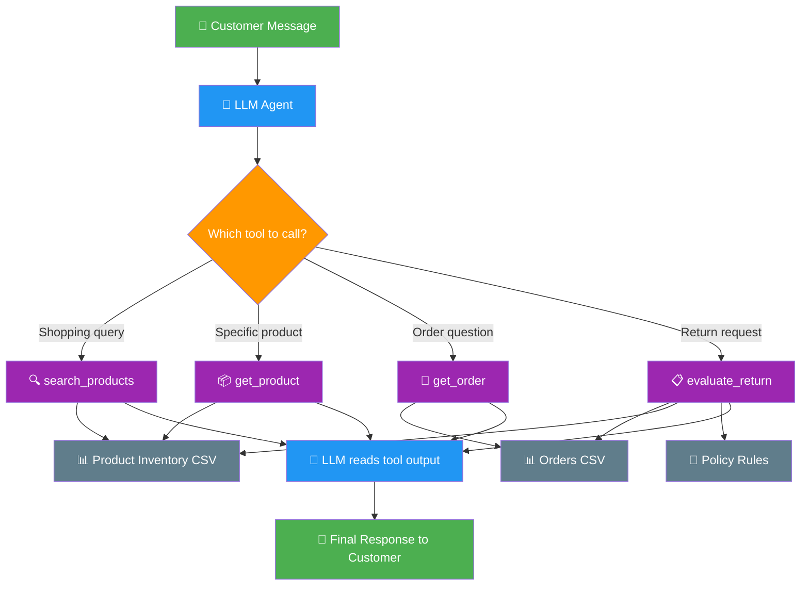
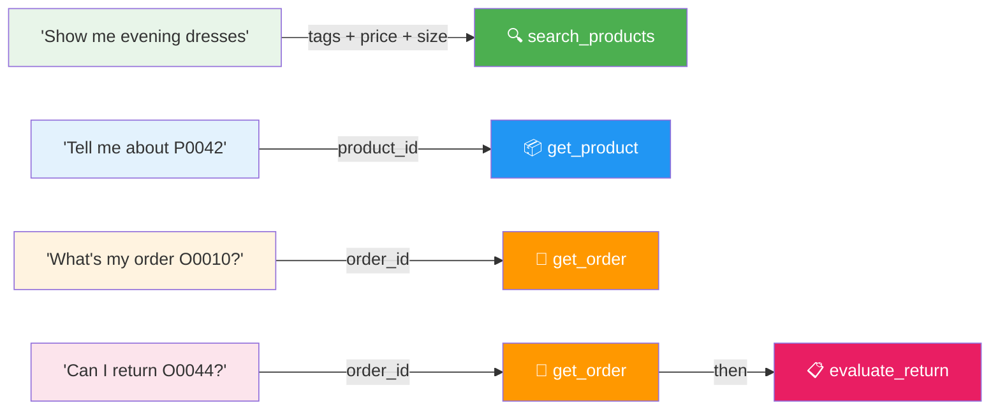
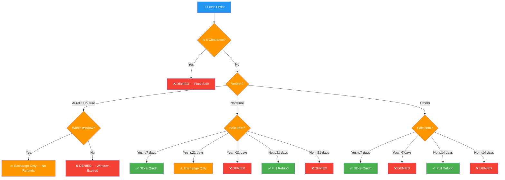
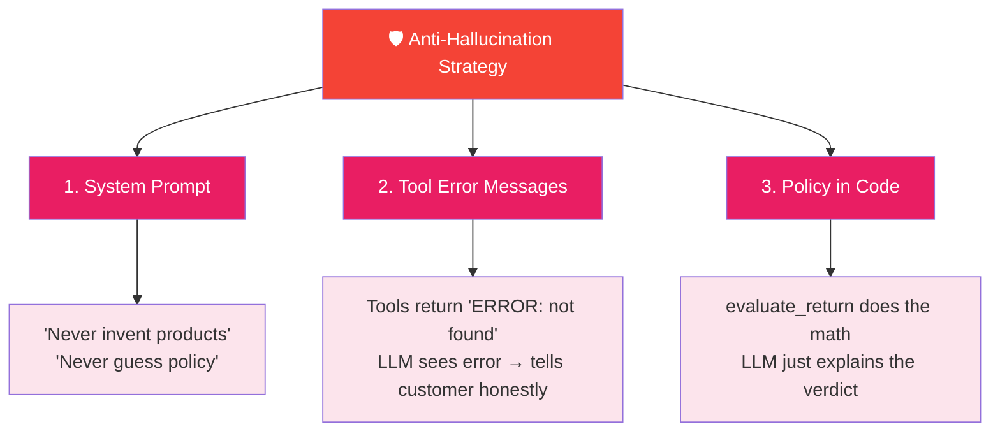

# WEBVORY — Retail AI Assistant

> A single AI agent that acts as both a **Personal Shopper** and **Customer Support Assistant** for a fashion boutique. It recommends products and handles return queries using real data — no hardcoded responses.

[](https://www.python.org/downloads/)
[](https://www.langchain.com/)
[](https://groq.com/)
[](https://smith.langchain.com/)

---

## ✨ Features

- 🛍️ **Personal Shopper** — Search by occasion, budget, size, tags & sale preference
- 📋 **Return Evaluator** — Automated policy checks with vendor-specific rules
- 🛡️ **Zero Hallucination** — Every response is grounded in CSV data & written policy
- 🔗 **LangSmith Tracing** — Every agent run is traced with unique run names
- 💾 **Auto-saved Demo Log** — Chat transcript saved to `demo.txt` on exit

---

## 🚀 Quick Start

**Python 3.12** required. Uses [`uv`](https://docs.astral.sh/uv/) for dependency management.

```bash
# 1. Clone the repo
git clone https://github.com/farhanrhine/webvory.git
cd webvory

# 2. Create env and install dependencies (uv handles everything)
uv sync

# 3. Add your API key
cp .env.example .env
# Edit .env and paste your GROQ_API_KEY

# 4. Run the agent
uv run python retail_agent.py
```

> ⚠️ **Windows Users:** If your terminal auto-activates a virtual environment on startup, run `deactivate` first before running the commands above. An already-active venv can conflict with `uv`.

Type your question, get an answer. Type `exit` or press `Ctrl+C` to quit.  
Chat gets auto-saved to `demo.txt` when you exit.

---

## 📂 Project Structure

| File | What it does |
|------|-------------|
| `retail_agent.py` | The entire agent — data loading, 4 tools, system prompt, chat loop. **Single file.** |
| `product_inventory.csv` | 100 dresses with price, size, stock, tags, vendor, sale/clearance status |
| `orders.csv` | 100 past orders with date, product, size, price paid |
| `policy.txt` | Return policy rules (normal, sale, clearance, vendor exceptions) |
| `demo.txt` | ✅ Completed demo transcript — 5 scenarios with real agent responses |
| `test.ipynb` | Notebook for exploring and understanding the data |
| `.env.example` | Template for your API key |

---

## 🏗️ Architecture

### Why One Agent With Tools?

The task needs one agent that does two jobs — recommend products and evaluate returns. Instead of building two separate systems, we use LangChain's `create_agent()` which gives the LLM four tools. The LLM reads the customer's message and picks the right tool on its own. No if/else routing needed.

### How the Agent Works



### How Tools Are Selected

The LLM uses native function calling. Each tool has a name, description, and typed arguments. The LLM picks the best match automatically.



### Return Policy Decision Tree

The `evaluate_return` tool follows this exact checklist — top to bottom, stops at the first match:



### How Hallucination Is Prevented



---

## 🧰 Tech Stack

| Component | Technology |
|-----------|-----------|
| **LLM** | Qwen3-32B via Groq |
| **Framework** | LangChain (`create_agent`) |
| **Tracing** | LangSmith |
| **Data** | Pandas + CSV |
| **Package Manager** | uv |

---

## 🎬 Demo — Completed Scenarios

All scenarios have been executed and responses are saved in [`demo.txt`](demo.txt).

### 🛍️ Shopping Scenarios

#### Scenario 1
**Input:** `I need a modest evening gown under $300 in size 8. I prefer something on sale.`
- 🔗 [LangSmith Trace](https://smith.langchain.com/public/64ca7af6-eaa8-473c-af6d-64dd41811bdd/r)

#### Scenario 2
**Input:** `Show me sparkle bridal dresses under $250 in size 4.`

#### Scenario 3
**Input:** `I'm looking for a cocktail dress with lace. Budget is $200. Size 6.`
- 🔗 [LangSmith Trace](https://smith.langchain.com/public/313e7759-1f67-45a9-aa80-ae722aa48ca1/r)

#### Scenario 4
**Input:** `What prom dresses do you have in size 10? I want something flowy.`

### 📋 Support Scenarios

#### Scenario 5
**Input:** `I want to return order O0044. The dress doesn't fit.`
- 🔗 [LangSmith Trace](https://smith.langchain.com/public/49c92246-04a2-446a-b464-0e270baa76b0/r)

#### Scenario 6
**Input:** `Can I return order O0026? I changed my mind.`

#### Scenario 7
**Input:** `Order O0043 — I bought this weeks ago. Can I get a refund?`
- 🔗 [LangSmith Trace](https://smith.langchain.com/public/04db2390-87ac-4292-89c1-ed6eef10f307/r)

#### Scenario 8
**Input:** `I'd like to return order O0010. It arrived damaged.`

### ⚠️ Edge Cases

#### Scenario 9 — Invalid Order
**Input:** `I need to return order O9999. Please help.`
- 🔗 [LangSmith Trace](https://smith.langchain.com/public/ea85afac-aa0b-4ca0-a22f-0726c955cc02/r)

#### Scenario 10 — Invalid Product
**Input:** `Tell me about product P5000.`

---
